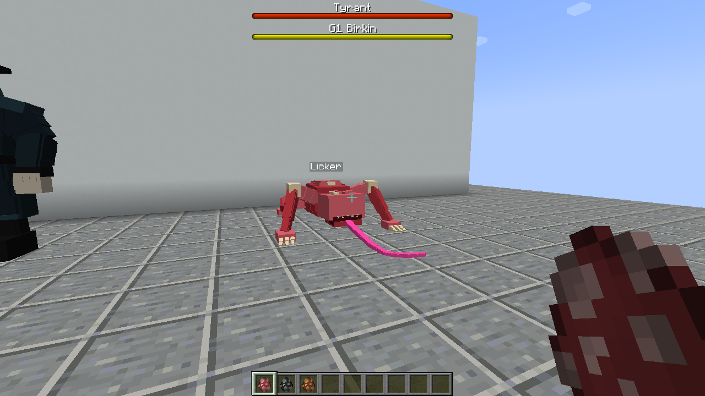
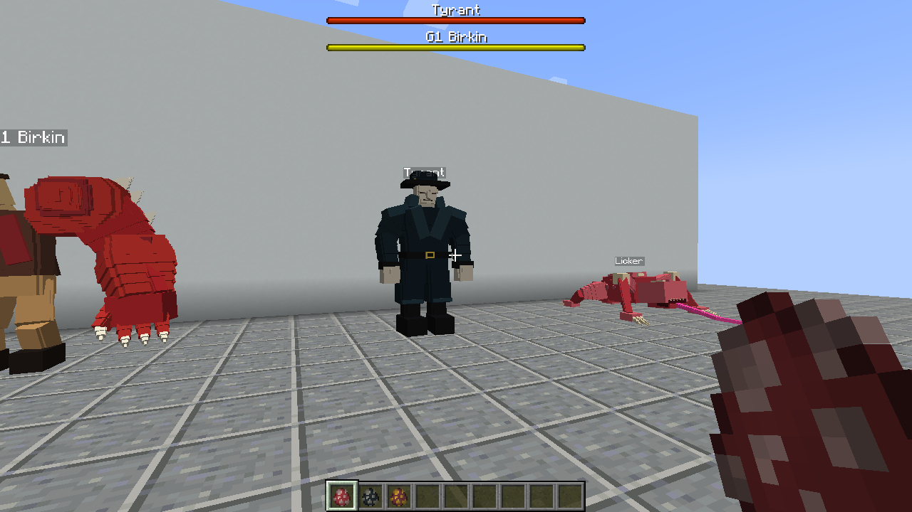
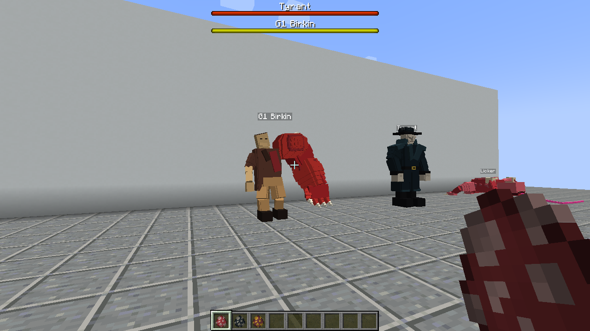
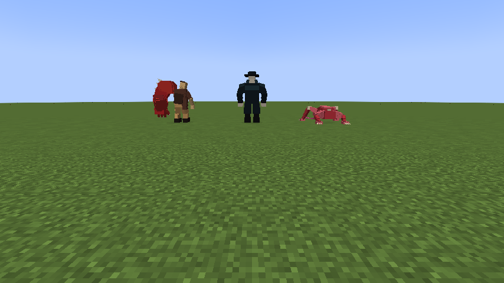
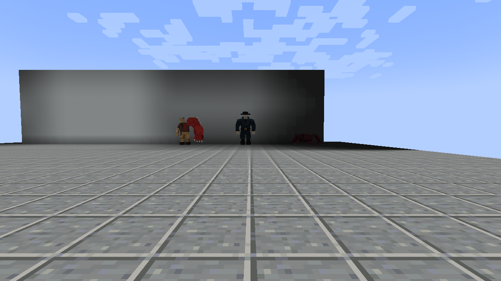

# Client evidence captured at 4c1aa7f

These unmodified PNGs and reports were downloaded from successful GitHub Actions
run [37336113608](https://github.com/ZeroPointSix/resident-evil-forge-demo/actions/runs/37336113608).
Capture source: `4c1aa7fc793af60c03b97f5fee2a6b38bc365292`.

The later documentation commit that publishes this directory is not the capture
source. Its CI must be checked separately. This archive does not replace runtime
evidence for a different source revision.

## Three-creature gallery

Click an image or its caption to inspect the original PNG.

| Licker | Tyrant | G1 Birkin |
| --- | --- | --- |
| [](licker-model.png) | [](tyrant-model.png) | [](g1_birkin-model.png) |
| [Original Licker PNG](licker-model.png) | [Original Tyrant PNG](tyrant-model.png) | [Original G1 Birkin PNG](g1_birkin-model.png) |

[](dev-client-in-world.png)

[Development client, three creatures together](dev-client-in-world.png).
From left to right: G1 Birkin, Tyrant, Licker.

## Distance views

[](20-block-identification.png)

[Original 20-block group PNG](20-block-identification.png).
The Licker is in shadow at the right edge. This frame alone does not establish
readability under all lighting conditions.

Individual distance views:
[Licker](licker-20blocks.png),
[Tyrant](tyrant-20blocks.png),
[G1 Birkin](g1_birkin-20blocks.png).

## Provenance and verification

| Source | Artifact | Downloaded ZIP SHA-256 |
| --- | --- | --- |
| Packaged client | [11356953401](https://github.com/ZeroPointSix/resident-evil-forge-demo/actions/runs/37336113608/artifacts/11356953401) | `a9d3002e582afc174007e4cef064b4416b2543152e630237f8cec208477fb714` |
| Development client | [11356598232](https://github.com/ZeroPointSix/resident-evil-forge-demo/actions/runs/37336113608/artifacts/11356598232) | `995bf6fd35464ebecccf309d95e8a21accfc0d9b1caedb41c1ef6d3d1114f967` |

Both downloaded ZIP digests matched GitHub's artifact metadata. ZIP CRC checks
passed. Each archived image and report is byte-identical to its source ZIP entry;
see [provenance.json](provenance.json) and [sha256sums.txt](sha256sums.txt).

Reports: [packaged client](capture-report.json) and
[development client](devenv-report.json).

Run from this directory:

```sh
sha256sum -c sha256sums.txt
```

## Acceptance boundaries

This is an evidence archive, not an independent review or a merge approval.
The client was driven by automation. `manual_playtest=false`,
`full_gameplay_acceptance=false`, and `visual_quality_review_required=true`
remain in force. The distinct silhouettes and flat-color textures do not
constitute final art acceptance. Two different independent reviewers and the
Notion functional acceptance are still required. PR #5 must stay draft;
no main merge, production release, or Linear Done transition is authorized.
