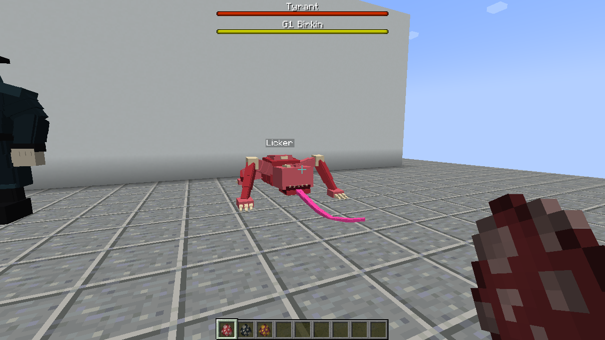
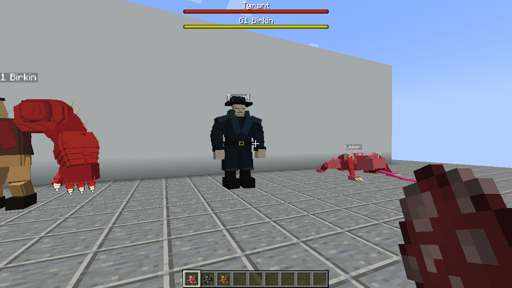
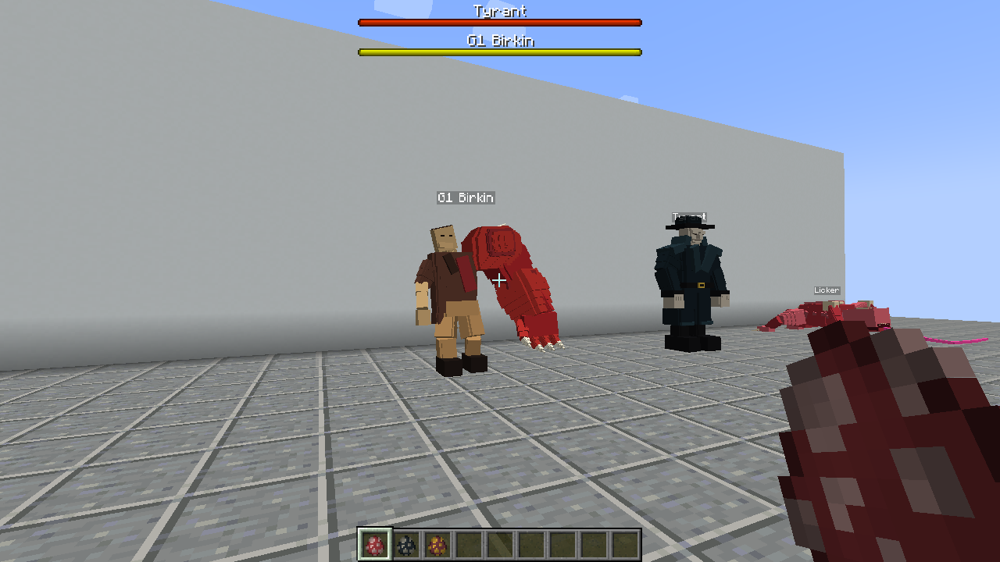
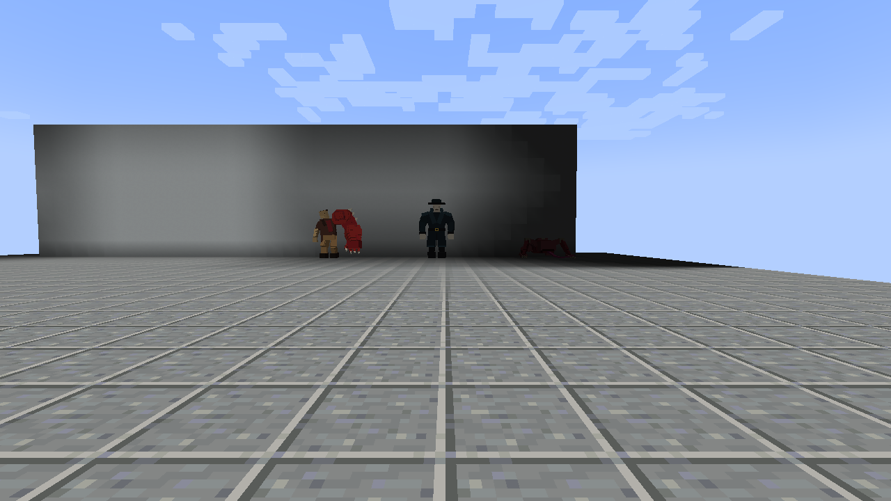

# Client evidence captured at 580c39f

These unmodified PNGs and reports were downloaded from successful GitHub Actions
run [37350172183](https://github.com/ZeroPointSix/resident-evil-forge-demo/actions/runs/37350172183)
(client evidence artifact [11362992374](https://github.com/ZeroPointSix/resident-evil-forge-demo/actions/runs/37350172183/artifacts/11362992374),
dev-env artifact [11363106025](https://github.com/ZeroPointSix/resident-evil-forge-demo/actions/runs/37350172183/artifacts/11363106025)).
Capture source: `580c39f6f689b1fa2bd7da1acb06f89bfb6c1eca`.

Compared to the earlier archives this set also includes the model **back views**
(front of the evidence wall since `580c39f`) and per-scene stills
(spawn eggs, ceiling ambush, wall climb, sneak/sprint, 20-block singles,
post-death cleared arena).

The later documentation commit that publishes this directory is not the capture
source. Its CI must be checked separately. This archive does not replace runtime
evidence for a different source revision.

## Three-creature gallery

| Licker | Tyrant | G1 Birkin |
| --- | --- | --- |
| [](licker-model.png) | [](tyrant-model.png) | [](g1_birkin-model.png) |

Back views: [Licker](licker-model-back.png) · [Tyrant](tyrant-model-back.png) ·
[G1 Birkin](g1_birkin-model-back.png). Side views: [Licker](licker-model-side.png) ·
[Tyrant](tyrant-model-side.png) · [G1 Birkin](g1_birkin-model-side.png).

## Scenes

| Scene | PNG |
| --- | --- |
| Three creatures, boss bars | [00-three-creatures.png](00-three-creatures.png) |
| Spawn eggs on hotbar | [01-spawn-eggs.png](01-spawn-eggs.png) |
| Ceiling ambush (hanging licker) | [licker-ambush.png](licker-ambush.png) |
| Wall climb | [licker-climb.png](licker-climb.png) |
| Sneak control (not pulled) | [licker-sneak-silent.png](licker-sneak-silent.png) |
| Sprint hunt (pulled to contact) | [licker-sprint-hunt.png](licker-sprint-hunt.png) |
| Death cleanup (arena cleared) | [99-death-cleared.png](99-death-cleared.png) |
| Dev client, three creatures | [dev-client-in-world.png](dev-client-in-world.png) |

## Distance views

[](20-block-identification.png)

[Original 20-block group PNG](20-block-identification.png). The Licker sits in a
dimmer corner; this frame alone does not establish readability under all
lighting conditions.

Individual distance views: [Licker](licker-20blocks.png),
[Tyrant](tyrant-20blocks.png), [G1 Birkin](g1_birkin-20blocks.png).

## Provenance and verification

| Source | Artifact | Downloaded ZIP SHA-256 |
| --- | --- | --- |
| Packaged client | [11362992374](https://github.com/ZeroPointSix/resident-evil-forge-demo/actions/runs/37350172183/artifacts/11362992374) | `d9ea4af809437a78d667ad03e7549bf2a70a07322fe4f229fc243dac10f82383` |
| Development client | [11363106025](https://github.com/ZeroPointSix/resident-evil-forge-demo/actions/runs/37350172183/artifacts/11363106025) | `bbe72bd50eea6a2cb51c3743fbad6a1387b7e155d3c50981acf63f744474111d` |

Both downloaded ZIP digests matched GitHub's artifact metadata. ZIP CRC checks
passed. Each archived file is byte-identical to its source ZIP entry; see
[provenance.json](provenance.json) and [sha256sums.txt](sha256sums.txt).

Reports: [packaged client](capture-report.json) and
[development client](devenv-report.json).

Run from this directory:

```sh
sha256sum -c sha256sums.txt
```

## Acceptance boundaries

This is an evidence archive, not an independent review or a merge approval.
The client was driven by automation. `manual_playtest=false`,
`full_gameplay_acceptance=false`, and `visual_quality_review_required=true`
remain in force. The distinct silhouettes and flat-color textures do not
constitute final art acceptance. A second different independent review and the
Notion functional acceptance are still required. PR #5 must stay draft;
no main merge, production release, or Linear Done transition is authorized.
