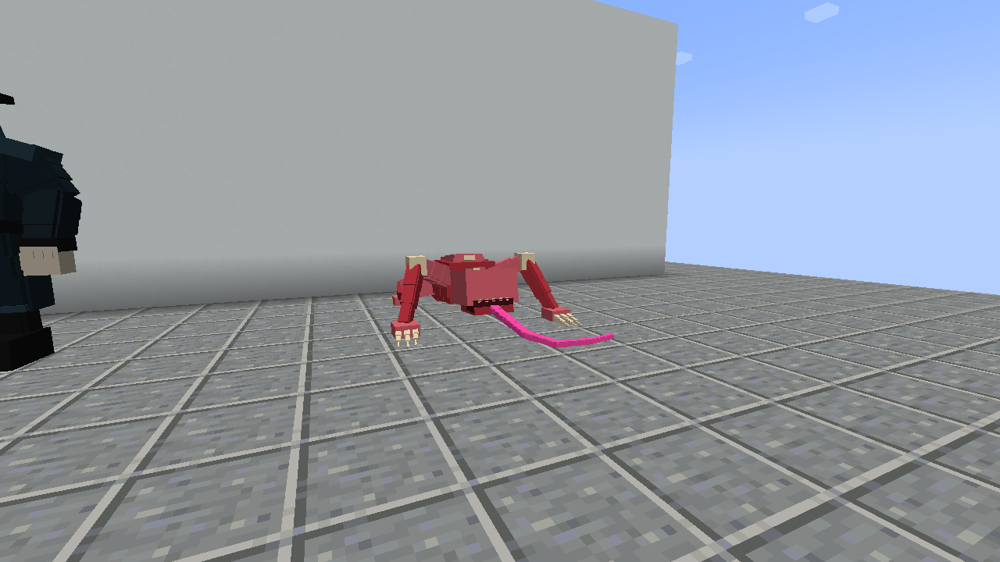
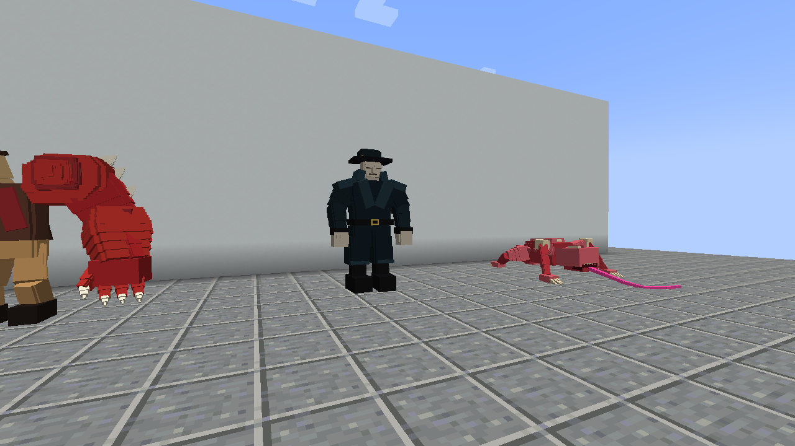
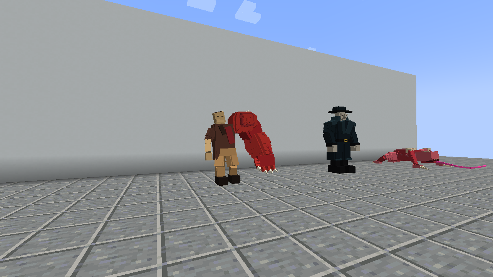
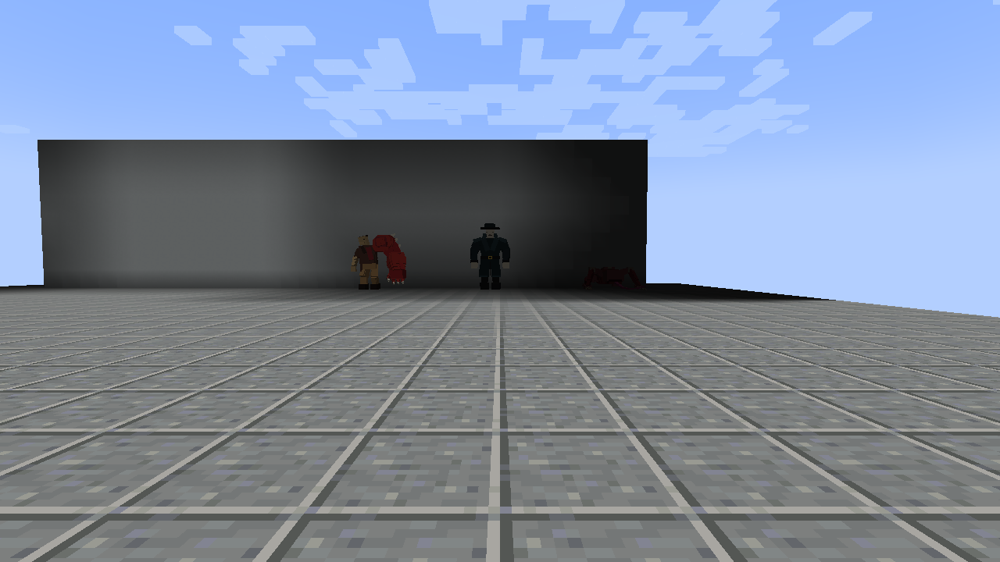

# Client evidence captured at 5ceb006

These unmodified PNGs and the capture report were downloaded from GitHub Actions
run [37368922271](https://github.com/ZeroPointSix/resident-evil-forge-demo/actions/runs/37368922271)
(client evidence artifact [11370040909](https://github.com/ZeroPointSix/resident-evil-forge-demo/actions/runs/37368922271/artifacts/11370040909)).
Capture source: `5ceb006714a0347ce771ebaf9f1d4c7c40f966e2`.

This set is the HUD-off follow-up to [580c39f/](../580c39f/README.md): F1 hides the
hotbar and boss bars on portraits, sneak, ambush, climb, death, and 20-block
shots. Spawn-egg hotbar still keeps HUD. Sneak phase B is unsneaked walk
footsteps only (no jump / hurt / arrow mix). The later documentation commit
that publishes this directory is not the capture source.

The development-client job on this run was still queued when the archive was
written, so `dev-client-in-world.png` is not in this folder. Use
[580c39f/dev-client-in-world.png](../580c39f/dev-client-in-world.png) for the
last archived `gradlew runClient` still.

## Three-creature gallery (HUD off)

| Licker | Tyrant | G1 Birkin |
| --- | --- | --- |
| [](licker-model.png) | [](tyrant-model.png) | [](g1_birkin-model.png) |

Back views: [Licker](licker-model-back.png) · [Tyrant](tyrant-model-back.png) ·
[G1 Birkin](g1_birkin-model-back.png). Side views: [Licker](licker-model-side.png) ·
[Tyrant](tyrant-model-side.png) · [G1 Birkin](g1_birkin-model-side.png).

## Scenes

| Scene | PNG |
| --- | --- |
| Three creatures (HUD off) | [00-three-creatures.png](00-three-creatures.png) |
| Spawn eggs on hotbar | [01-spawn-eggs.png](01-spawn-eggs.png) |
| Ceiling ambush | [licker-ambush.png](licker-ambush.png) |
| Wall climb | [licker-climb.png](licker-climb.png) |
| Sneak control (not pulled) | [licker-sneak-silent.png](licker-sneak-silent.png) |
| Loud walk hunt (pulled to contact) | [licker-sprint-hunt.png](licker-sprint-hunt.png) |
| Death cleanup | [99-death-cleared.png](99-death-cleared.png) |

## Distance views

[](20-block-identification.png)

Individual: [Licker](licker-20blocks.png), [Tyrant](tyrant-20blocks.png),
[G1 Birkin](g1_birkin-20blocks.png).

## Provenance

| Source | Artifact | Downloaded ZIP SHA-256 |
| --- | --- | --- |
| Packaged client | [11370040909](https://github.com/ZeroPointSix/resident-evil-forge-demo/actions/runs/37368922271/artifacts/11370040909) | `8afd6f5500c8ff97b106c57b448a3ef7f89f48283617f029187385712b232b17` |

The downloaded ZIP digest matched GitHub's artifact metadata. Each archived
file is byte-identical to its source ZIP entry; see
[provenance.json](provenance.json) and [sha256sums.txt](sha256sums.txt).
Report: [capture-report.json](capture-report.json) (`zip_entry` `report.json`).

```sh
sha256sum -c sha256sums.txt
```

## Acceptance boundaries

`manual_playtest=false`, `full_gameplay_acceptance=false`,
`visual_quality_review_required=true`. This archive is not art sign-off, not a
free-play / TTK session, and not a Notion complete checkbox. PR #5 must stay
draft; no main merge, production release, or Linear Done.
