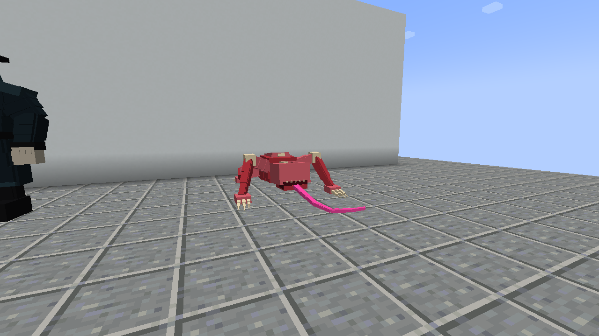
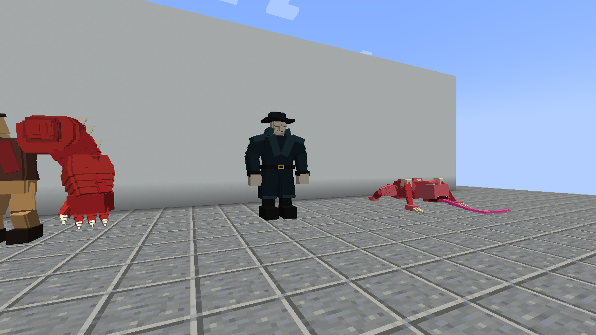
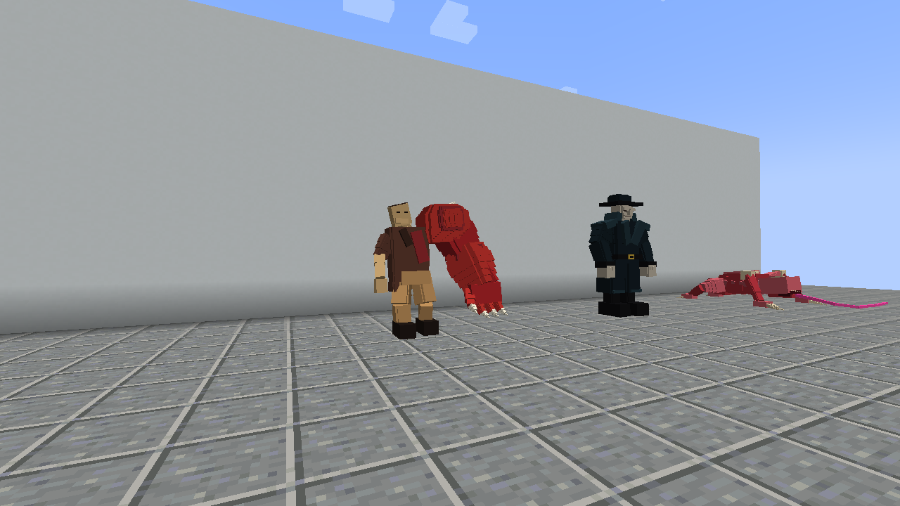
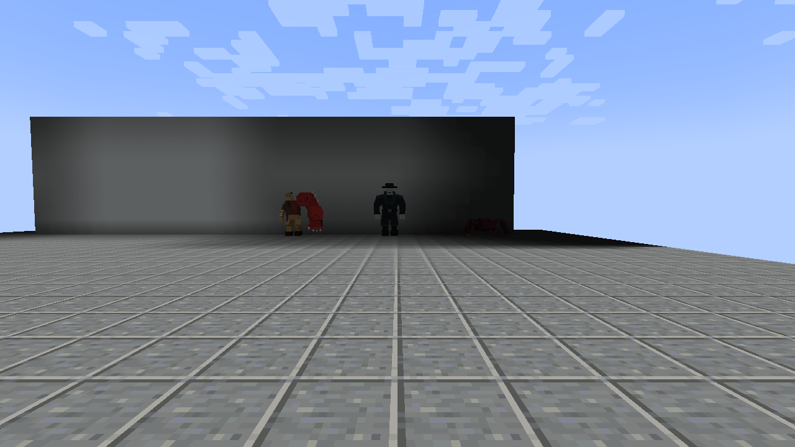

# Client evidence captured at 76e2b8b

These unmodified PNGs and the two reports were downloaded from GitHub Actions
run [37378166487](https://github.com/ZeroPointSix/resident-evil-forge-demo/actions/runs/37378166487)
— client evidence artifact
[11373057409](https://github.com/ZeroPointSix/resident-evil-forge-demo/actions/runs/37378166487/artifacts/11373057409)
and dev-env evidence artifact
[11372333868](https://github.com/ZeroPointSix/resident-evil-forge-demo/actions/runs/37378166487/artifacts/11372333868).
Capture source: `76e2b8bc9795285200fafce23bcd39979c5ffd22`.

This set extends [5ceb006/](../5ceb006/README.md): HUD-off stills are kept, the
loud stimulus in phase B is **sustained sprint footsteps only** (no jump / hurt /
arrow mix, licker noise radius 20 vs sneak 0), and a new
[g1_birkin-eye.png](g1_birkin-eye.png) close-up shows the G1 shoulder eye in its
open exposure pose (A7 machine-visible evidence — a dedicated berserk-staged
instance framed from the north-west at eye level). The run also produced
`dev-client-in-world.png` from the same run's dev-env job.

## Three-creature gallery (HUD off)

| Licker | Tyrant | G1 Birkin |
| --- | --- | --- |
| [](licker-model.png) | [](tyrant-model.png) | [](g1_birkin-model.png) |

Back views: [Licker](licker-model-back.png) · [Tyrant](tyrant-model-back.png) ·
[G1 Birkin](g1_birkin-model-back.png). Side views: [Licker](licker-model-side.png) ·
[Tyrant](tyrant-model-side.png) · [G1 Birkin](g1_birkin-model-side.png).

## Scenes

| Scene | PNG |
| --- | --- |
| Three creatures (HUD off) | [00-three-creatures.png](00-three-creatures.png) |
| Spawn eggs on hotbar | [01-spawn-eggs.png](01-spawn-eggs.png) |
| G1 shoulder eye open (berserk exposure pose) | [g1_birkin-eye.png](g1_birkin-eye.png) |
| Ceiling ambush | [licker-ambush.png](licker-ambush.png) |
| Wall climb | [licker-climb.png](licker-climb.png) |
| Sneak control (not pulled) | [licker-sneak-silent.png](licker-sneak-silent.png) |
| Sprint footstep hunt (pulled to contact) | [licker-sprint-hunt.png](licker-sprint-hunt.png) |
| Death cleanup | [99-death-cleared.png](99-death-cleared.png) |
| Dev client in world (`gradlew runClient`) | [dev-client-in-world.png](dev-client-in-world.png) |

## Distance views

[](20-block-identification.png)

Individual: [Licker](licker-20blocks.png), [Tyrant](tyrant-20blocks.png),
[G1 Birkin](g1_birkin-20blocks.png).

## Provenance

| Source | Artifact | Downloaded ZIP SHA-256 |
| --- | --- | --- |
| Packaged client | [11373057409](https://github.com/ZeroPointSix/resident-evil-forge-demo/actions/runs/37378166487/artifacts/11373057409) | `d559ea71cd8cffadb4c955d28b8754fa03ab88961de8a448c466901b507da019` |
| Dev environment | [11372333868](https://github.com/ZeroPointSix/resident-evil-forge-demo/actions/runs/37378166487/artifacts/11372333868) | `61f761d279b6ddcee6c136bcbff9e18ab227c13cda11f5c7a0d5e7eae8532664` |

Each downloaded ZIP digest matched GitHub's artifact metadata. Each archived
file is byte-identical to its source ZIP entry; see
[provenance.json](provenance.json) and [sha256sums.txt](sha256sums.txt).
Reports: [capture-report.json](capture-report.json) (`zip_entry` `report.json`),
[devenv-report.json](devenv-report.json) (`zip_entry` `report.json` in the
dev-env artifact).

```sh
sha256sum -c sha256sums.txt
```

## Acceptance boundaries

`manual_playtest=false`, `full_gameplay_acceptance=false`,
`visual_quality_review_required=true`. This archive is not art sign-off, not a
free-play / TTK session, and not a Notion complete checkbox. PR #5 must stay
draft; no main merge, production release, or Linear Done.
