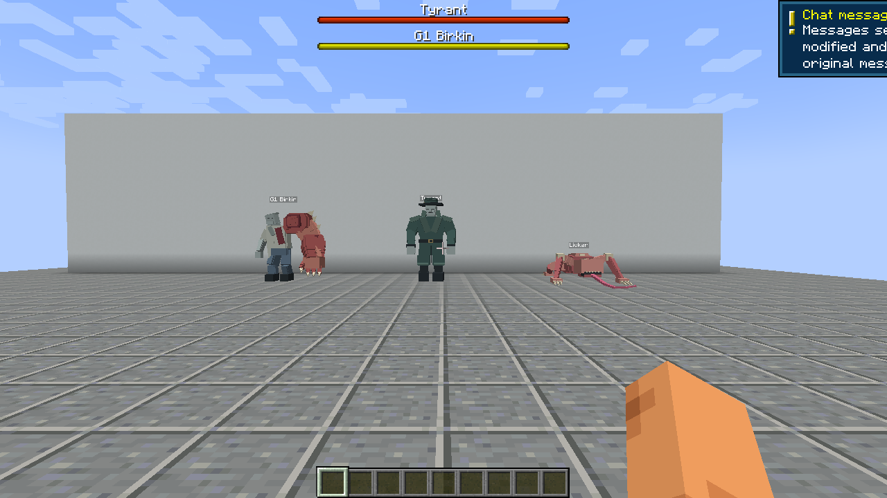
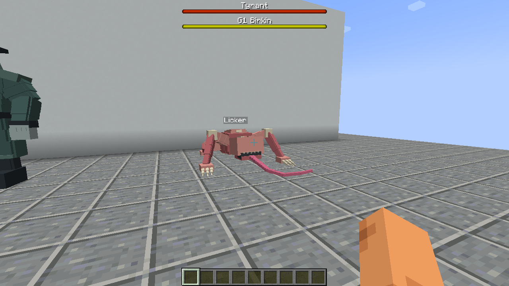
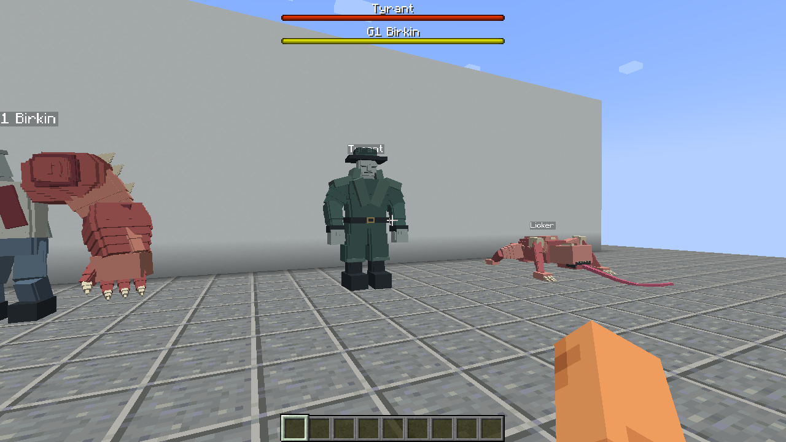
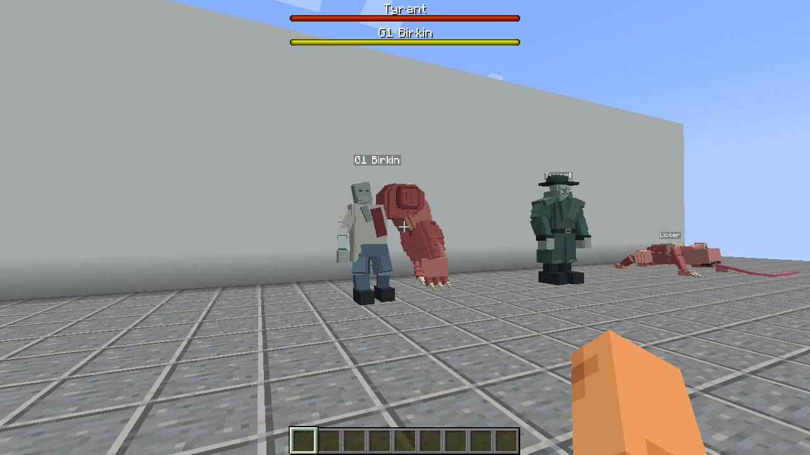
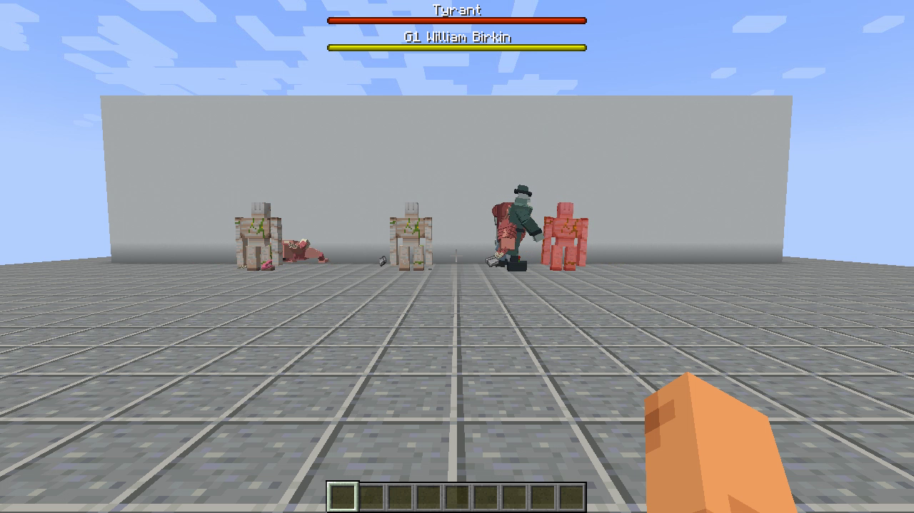

# Review2 修复后的真实客户端证据

本目录固化已通过的修复提交 `fb977ec97e5cf547eb8c29393e2af17f3f2e0ed7`。来源为 [client-evidence 37273575599](https://github.com/ZeroPointSix/resident-evil-forge-demo/actions/runs/37273575599)，[完整工件 11329822406](https://github.com/ZeroPointSix/resident-evil-forge-demo/actions/runs/37273575599/artifacts/11329822406) 包含原始视频、日志和实际安装的 JAR。

这组画面使用修复后的 `re_demo-0.1.2.jar`，Minecraft 1.20.1、Forge 47.2.0、Java 17、GeckoLib Forge 4.4.9。随后证据入库提交将安装包标识更新为 **0.1.3**，不再修改战斗代码或模型资源。0.1.3 必须在该最终提交上重新通过 Build 与客户端验收；最终流水线、下载入口和哈希以 [PR #5 结论](https://github.com/ZeroPointSix/resident-evil-forge-demo/pull/5) 为准，不能把本目录旧哈希当作 0.1.3 哈希。

本次实际安装且已从工件独立计算的 0.1.2 JAR SHA-256：

`590c59624e28a06f01b06c66a1a6fbca2047be89992d31b2624907bab3fb9d38`

## 可复查结果

- [原始 report.json](report.json)：`passed=true`；客户端和服务端安装同一 JAR，玩家已加入并完成真实移动往返验证。
- [原始 animation-sync.json](animation-sync.json)：2892 个实际 GeckoLib 骨骼动画队列样本，三怪首次晚入镜及同次攻击重新入镜均通过。
- [客户端同步摘录](client-sync.log) 与 [服务端同步摘录](server-sync.log)：从原始日志机械筛选对应实体 UUID 的 `seq=1`，行内容未改写。完整日志仍在工件中。
- 同一 SHA 的 [push Build](https://github.com/ZeroPointSix/resident-evil-forge-demo/actions/runs/37273575667) 与 [PR Build](https://github.com/ZeroPointSix/resident-evil-forge-demo/actions/runs/37273579365) 均通过，24/24 项 GameTest；[QA](https://github.com/ZeroPointSix/resident-evil-forge-demo/actions/runs/37273579382) 68/68。

## F1：肩眼与背面身体命中

命中判定比较攻击射线与肩眼、身体包围盒的首个交点。开眼时，背面先碰到身体的攻击不能获得肩眼 1.75 倍；正面肩眼先命中仍获得防御结算后的 1.75 倍。

GameTest 对四种身体朝向、横扫开眼第 20 tick 和峰值第 29 tick，使用真实箭矢和 FakePlayer 的 `player.attack` 验证：

- `sweepEyeAcceptsRealArrowsAtOpeningAndPeak`
- `sweepEyeAcceptsPlayerMeleeAtOpeningAndPeak`
- `openEyeDoesNotAmplifyRearBodyArrows`
- `openEyeDoesNotAmplifyRearBodyMelee`

测试用原生 GameTest sequence 逐 tick 等待精确帧，未扩大开眼窗口或放宽倍率断言。设计引用见 [Notion 核验评论](https://github.com/ZeroPointSix/resident-evil-forge-demo/pull/5#issuecomment-5988669154)。

## F2：攻击进度同步

服务端复制 `ATTACK_TICK` 和唯一攻击序号。客户端在 GeckoLib 采样前定位到 `(ATTACK_TICK + render partialTick) * animation speed`，只在新攻击序号时重置；首次出现的零长过渡也在同帧完成。日志采集的是 GeckoLib 实际骨骼队列中的关键帧点，不是另算一遍预期值冒充实际输出。

受控场景先让怪物在镜头背后用正常 AI 发起攻击，再转向它；同次攻击中转开至少 0.35 秒后再转回。验证要求实体 UUID、攻击序号和攻击类型一致，且实际采样进度与收到的服务端 tick 对齐。

| 怪物 | 首次晚入镜 tick | 同次攻击离镜前 tick | 重新入镜 tick | 重新入镜实际动画进度 |
| --- | --- | --- | --- | --- |
| 舔食者 | 4 | 7 | 15 | 15.01999 |
| 暴君 | 4 | 7 | 15 | 15.83999 |
| G1 柏金 | 9 | 7 | 14 | 14.73999 |

G1 的首次晚入镜与重新入镜成功样本来自两个分别记录的实体尝试，不能把它们混成一次攻击。重新入镜样本自身的前后记录始终来自同一个 UUID 和 `seq=1`，见原始摘录。这里证明的是客户端对已收到的服务端状态正确采样，不声称网络延迟为零。

## 三怪真实 AI 与刷怪蛋

`report.json` 的 confirmations 55-58 确认三只怪在同一场景分别对静止高血量铁傀儡造成 **大于 5 HP** 的真实 AI 伤害，未对目标注入脚本伤害。没有降低此门槛。修复保留舔食者接触近战时的爬墙保护、有效近战目标保持，并将受击仇恨锁定与六秒声音记忆分离；`lickerHurtAggroIgnoresExpiredSoundMemory` 验证安静受击目标不会仅因声音过期而被忘掉。

三颗蛋由 GameTest `spawnEggsCreateRealEntities` 真实调用 `egg.useOn` 生成对应实体；客户端布景通过 `/summon` 创建，**以下截图不冒充手持刷怪蛋操作证据**。三怪独立攻击、冲锋、舌击、爬墙接近视频以及 119 秒合辑均在完整工件中。

## 新实机画面

四张原生 Minecraft F2 文件的哈希与 `report.json` 一致，已目视检查模型、贴图与 HUD。未重导出或改写模型、骨架、贴图、几何或动画资源。

下图来自本次 `creature-brawl.mp4` 的 **18.0 秒**，仅作同场战斗画面；不是原生 F2，也不是逐帧伤害或同步判定的替代品。

## 边界

- `manual_playtest=false`、`full_gameplay_acceptance=false`：这是安装版官方客户端和专服的受控自动验收，不是完整人工生存试玩。
- 肖像场为 NoAI 定位；战斗与同步场使用正常 AI。伤害倍率由 GameTest 断言，画面不单独证明倍率。
- PR 保持 draft，未合并 main，未使用 Colab。
